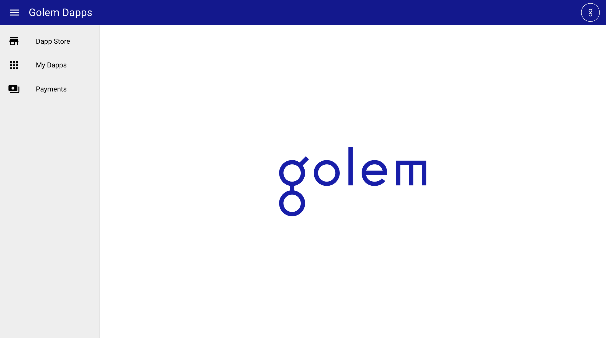
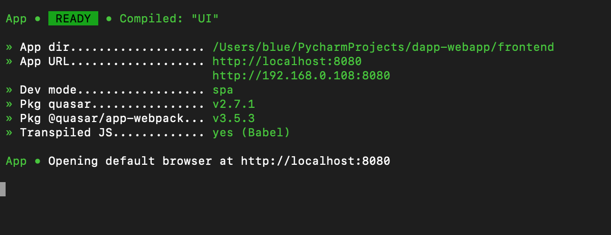
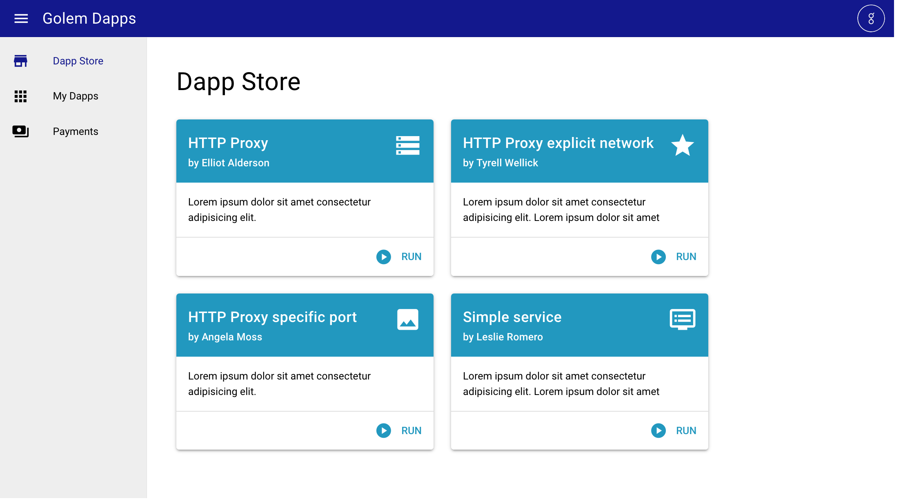
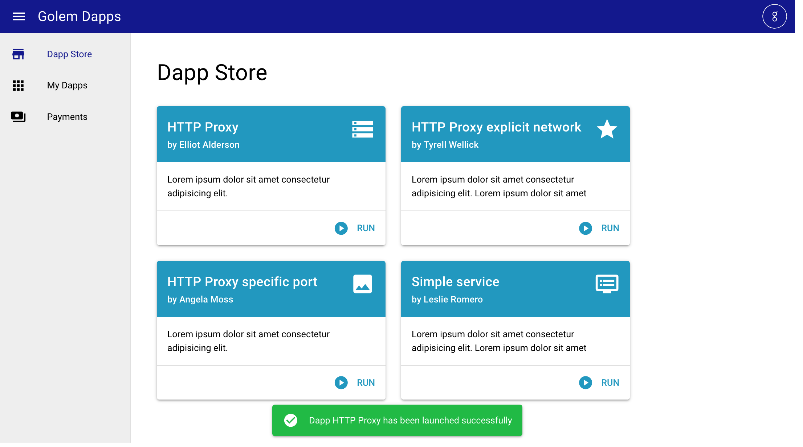
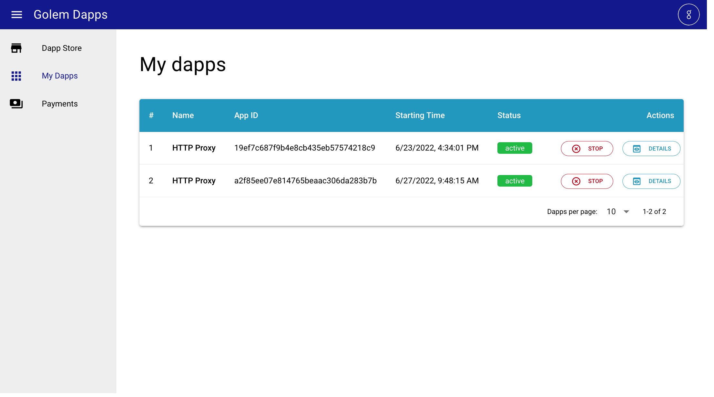
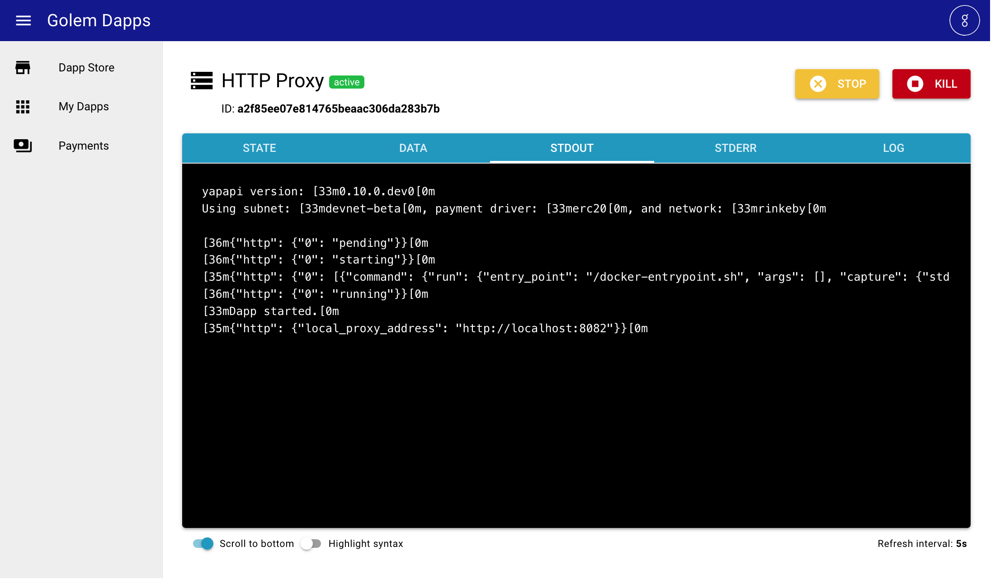

# Web interface for the dApp Manager

`dapp-webapp` in its current form is a proof-of-concept web interface for the [dapp-manager](https://github.com/golemfactory/dapp-manager/), making the deployment of decentralized applications on Golem extremely trivial, using just a few clicks.

It consists of two components: the front-end and the back-end, and quite obviously, both are required in
order for the web interface to function. For instructions on how to run them, please refer to their respective manuals:

* [Front-end README](frontend/README.md)
* [Back-end README](backend/README.md)

### Disclaimer

Please remember that this simple web application is just a proof-of-concept. It shows how Golem can be
used to enable trivial deployment of whole decentralized applications, possibly consistin of multiple
nodes and services but this app itself is by no means complete.

## Usage

If you have set-up the front-end and the back-end correctly, after you start both of them, the front-end should open your browser and you should be greeted with a title screen and a menu:

If you don't see it or you close the app accidentally, you can always re-open it by visiting the link shown
as the "App URL" after the front-end starts:

### Dapp store

By clicking the "Dapp store" in the menu, you access the list of apps that you can deploy to Golem.

Choose the app that you'd like to run, click its "RUN" button and confirm the operation. You should see a green confirmation after the app has been started:

### My Dapps

After you start your app - or apps - you can visit the list of decentralized apps that you have requested to be deployed to Golem's providers.

Each entry consists of the name of the app, it's application id (as assigned by the `dapp-manager`), the time it has been started on and it's current status (either "active" or "dead").

You can stop any of the active apps from here and, more interestingly, you can access the details of any of the listed applications.

#### Dapp details

After you click the "Details" button from the list of apps, you should see a screen containing the information about the specific application.

First, you have the status marker next to the name of the dapp, showing whether the given app is still active or whether it has already been terminated. In case of the active ones, you'll also see two buttons in the upper-right corner - "Stop" and "Kill". Those translate directly to `stop` and `kill` commands of the `dapp-manager` - `stop` performs a regular, graceful shutdown of the dapp and `kill` terminates it immediately. Obviously, you should normally only use `stop` and only resort to `kill` if the app does not respond to a regular shutdown.

Below, you have five tabs that correspond to the five output streams as managed by the `dapp-manager`:
* `STATE` - shows the stream of the state changes of all the services that constitue your decentralized app
* `DATA` - shows the `dapp-runner`'s data stream - that is the output of the scripts ran on each of the apps service instances and all the other components of your decentralized app (e.g. the HTTP proxy).
* `STDOUT`- shows the `dapp-runner`'s regular standard output as seen in the console.
* `STDERR` - shows the `dapp-runner`'s standard error stream - if your app has not started correctly, it is here that you'll most likely to see why
* and finally, `LOG` shows the full debug log stream from the `dapp-runner` which may help you debug any issues that pop up while running your apps.
